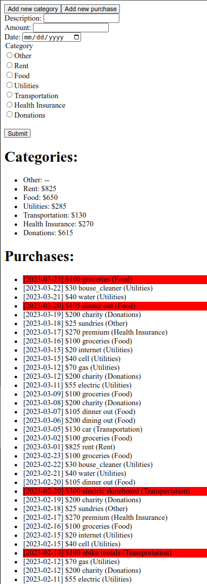

# CS1520 Project 4

## Goal:
To gain experience with building RESTful APIs, and working with multiple programming languages.

## High-level description:
You will write a budget application for a single user. Your
application should support several budget categories, and a set monthly limit
for each category (e.g., $825 for rent, $400 for groceries, $130 for gas,
etc.). The application should allow the user to enter new categories and
purchases and present up to date lists of the user's current categories and
past purchases. Any purchases that were over budget for that month should be
higlighted red in the list.

## Specifications:
1. You must build a RESTful API for accessing your budget category and purchase
	resources. Specifically, users should be able to:
	- Send HTTP GET requests to `/categories/` or `/purchases/` to get a list 
		of budget categories/purchases, respectively
	- Send HTTP POST requests to `/categories/` or `/purchases/` to add a new 
		category/purchase to the respective colletion
	- Send HTTP GET requests to `/categories/<cat_id_here>` or
		`/purchases/<pur_id_here>` to get a single category/purchase

1. Each Category should have 3 attributes: `id` (integer), `name` (string), and
	`budget` (integer). `budget` specifies how much is allotted for that
	category per month. A category with a `null` budget does not have a limit
	(e.g., no purchases, no matter what their total should be considered
	over-budget). Each category's `id` and `name` attributes should not be
	`null`. A category's `budget` attribute can be `null`.

1. Each purchase should have 5 attributes: `id` (integer), `desc` (string),
	`amount` (integer), `date` (string formatted as "YYYY-MM-DD"), and `cat_id`
	(integer referencing the `id` of a category). None of them should be
	`null`.

1. All data must be transmitted using JSON.

1. GET on `/purchases/` should return purchases in descending order by date
	(most recent first).

1. GET ON `/categories/` should return categories in ascending order by id
	(lowest first).

1. Since we assume for this project that your website manages the budget of
	only a single user, you do not need to implement any user management, login, or
	password authentication.

1. The actual webpage (frontend) does not need to be served by your API server
	(the backend). For this project it is fine to serve that on its own
	development server (e.g., using `npm start` for React) as demonstrated in lecture.

1. Once the user loads the frontend, they should see the following:
	- At the top should be two buttons: Add a new category, Add a new purchase.
	- Initially, below those buttons should be a list of categories.
	- Below the list of categories should be the list of purchases.
		- Any purchase that is over-budget (i.e., amount of that purchase is >
			the remaining budget not already spent in that category for the
			month of the purchase), should be highlighted (background color) in
			red.
	- If the user clicks on the button to add a category, a form to add a new
		category should be displayed between the buttons and the list of
		categories.
	- If the user clicks on the button to add a new purchase, a form to add a
		new purchase should be displayed between the buttons and the list of
		categories.
	- Only one of the forms should be visible at a time (e.g., if the user clicks
		add a category and then add a purchase, only the purchase form should
		be shown).
	- If one form is currently being displayed and the user clicks that button
		again, the form should be hidden (e.g., clicking to add a category twice
		should show and then hide the form).
	- Each form should send an AJAX POST request to the backend. After this request
		completes, the list of categories and purchases should be refetched to
		ensure up-to-date information is being displayed.
	- Example view of the frontend:

		

1. You do not need to regularly poll the server for updates. However, once the user
	requests any changes (e.g., add a purchase, add a category), your
	application should fetch updated information via the RESTful API, and
	rerender the list of categories and purchases.

1. For this project, it is acceptable to fetch the list of all categories or the
	list of all purchases each time (e.g., you do not need to fetch only new
	items).
	
1. Your backend must be written using Rust, Axum, and SeaORM.

1. All data must be stored in a persistant manner on the server side through
	the use of SeaORM. You must use an SQLite database in `budget.db`.

1. You are provided a Makefile for running the frontend and backend.
	Your TA will run `make setup_backend`, `make initdb`, and then `make setup_frontend`
	once before grading your project. Then, the TA will run `make run_backend`
	and `make run_frontend` everytime they need to start the server/client, respectively.
	- Be sure to make any edits to the Makefile to ensure your project will run
		easily for the TA.

1. After initializing your database (done with `make initdb`), your
	database should contain 0 purchases and 1 category named "Other" with a
	`null` budget.

## Submission Guidelines:
- **DO NOT SUBMIT** any IDE package files.

- You must fill out `INFO_SHEET.txt`.

- Be sure to remember to push the latest copy of your code back to your GitHub
	repository before submitting. To submit, log into GradeScope from Canvas and
	have GradeScope pull your repository from GitHub.

## Additional Notes/Hints:
- While you are not going to be heavily graded on the style and design of your
	web site, it should be presented in a clear and readable manner.

- You are strongly encouraged to test your backend via `curl`, `httpie`, or `curlie`.

## Grading Rubric:
| Feature | Points
| ------- | ------:
| Database is initialized as specified | 5%
| RESTful GET `/categories/` works | 10%
| RESTful GET `/purchases/` works | 10%
| RESTful POST `/categories/` works | 10%
| RESTful POST `/purchases/` works | 10%
| RESTful GET `/categories/<id>` works | 10%
| RESTful GET `/purchases/<id>` works | 10%
| Frontend add category works | 5%
| Frontend add purchase works | 5%
| Frontend correctly updates lists after either | 5%
| Frontend correctly displays list of categories | 5%
| Frontend correctly displays list of purchases | 5%
| Overbudget purchases are correctly highlighted red | 5%
| Submission/info sheet | 5%
